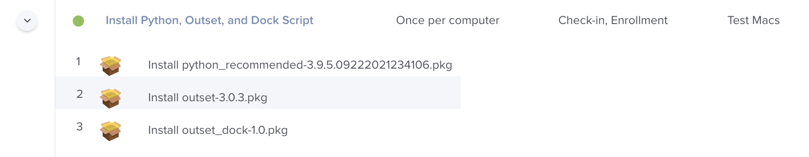

My post on [writing docklib scripts](../resilient-docklib/) walked you through how to use Python and [docklib](https://github.com/homebysix/docklib) to create a script for managing the macOS Dock, but stopped short of explaining the details of deploying and running the script on your Mac fleet. This post will cover one method for running your script: Outset.

[Outset](https://github.com/chilcote/outset) is a Python-based tool that kicks off tasks at login or startup. In relation to macOS Dock management, Outset's key benefits include easy execution in user context and flexible control of timing and recurrence.

If you're unfamiliar with creating your own LaunchAgents or if you're managing multiple dissimilar login or startup scripts, Outset may be worthy of your consideration.

## Contents

Our goal is to **run your Dock script at user login on your managed Macs**. The steps we'll follow towards that goal include:

<!-- List double spaced to prevent auto TOC. -->

1. [Package your script into an installer](#package-your-script)

1. [Gather dependencies: Outset and Python 3](#gather-dependencies)

1. [Deploy installers via your software management tool](#deploy-installers)

1. [Plan for maintenance and future adjustments](#plan-for-maintenance)

I'll provide examples for Jamf and Munki in step 3, but you should be able to leverage any similar tool to achieve the same result.

Let's get started!

## Package your script

First, you'll need to build an installer that places your Dock management script at the desired location on your managed Macs. For this, you won't be surprised that I recommend [MunkiPkg](https://github.com/munki/munki-pkg). Dock scripts are ideal candidates for MunkiPkg due to their small size, text contents, and the many [benefits of version control](../munkipkg-02-git/).


Perennial reminder: you can use MunkiPkg even if you're not using Munki to deploy the package.


### Packaging granularity

Your script should be packaged separate from Outset itself, so that you can update either the script or Outset independently of each other.

If you intend to run additional login or startup scripts with Outset, it's up to you whether you create separate packages for those scripts or combine them with your Dock script. My advice is to package your scripts separately if the scripts might target different groups of Macs in the future. If all the scripts equally apply to all your Macs, a unified package will work fine.

### Create a MunkiPkg project

1. First, navigate to where you store your package sources and create a new MunkiPkg project.

    ```sh
    cd ~/Developer/pkgs/
    munkipkg --create outset_dock
    cd outset_dock
    ```

1. Create a `README.md` file with a basic explanation of your package.

    Here's an example from a [previous post](../munkipkg-02-git/):

    ```md
    # Outset - Dock Script

    The installer produced by this source project installs an
    [Outset](https://github.com/chilcote/outset) script that sets the standard
    Dock items at user login.

    This folder is a [MunkiPkg](https://github.com/munki/munki-pkg) project.
    After making changes, be sure to increment the version in build-info.plist,
    then build the project with the `munkipkg` tool. The resulting pkg file will
    appear in the build folder.
    ```

1. Delete the `scripts` folder.

    ```sh
    rm -r scripts
    ```

    The Dock script will go in the payload rather than executing as a preinstall or postinstall script. This will allow Outset to execute our script with the proper timing and context.

1. Create the needed [payload structure](https://github.com/chilcote/outset/wiki/Customize) for Outset to run your script.

    If your Dock script is [idempotent](../resilient-docklib#enable-idempotence) and will run at every login, create a `login-every` folder. If your script should only run at the first/next login, create a `login-once` folder as shown below.

    ```sh
    mkdir -p payload/usr/local/outset/login-once/
    ```

1. Move your script into the `login-every` or `login-once` folder you just created.

    Your project's file system will now look like this:

    ```txt
    outset_dock
    ├── .gitignore
    ├── README.md
    ├── build
    ├── build-info.plist
    └── payload
        └── usr
            └── local
                └── outset
                    └── login-once
                        └── dock.py
    ```

1. Make your script executable. This is required for Outset to run it.

    ```sh
    chmod +x payload/usr/local/outset/login-once/dock.py
    ```

1. Customize the `build-info.plist` file. I typically adjust the bundle identifier to match my company's reverse-domain convention, like `com.pretendco.cpe.outset_dock`. You can optionally configure signing if you have a signing certificate, but this step is not essential when deploying with a software management tool like Munki or Jamf Pro.

1. Build the package.

    ```sh
    munkipkg .
    ```

1. Inspect the package with [Suspicious Package](https://mothersruin.com/software/SuspiciousPackage/) or another installer inspection utility.

    ```sh
    open -a "Suspicious Package" build/outset_dock-1.0.pkg
    ```

    Make sure the payload contains your Dock script (and nothing it shouldn't).

## Gather dependencies

Now that you've built an installer for your script, gather the installers for your script's dependencies.

- **Outset**: You can get the [latest release](https://github.com/chilcote/outset/releases/latest) from GitHub.

- **Python 3 with the docklib module**: Outset requires Python 3. Deploying the [MacAdmins Python "recommended" package](https://github.com/macadmins/python/releases/latest) is the easiest way to satisfy this requirement.

    If you plan on using a different Python installer, you'll need to ensure the docklib module is [installed](https://github.com/homebysix/docklib#installation), and you'll need to modify your script's [shebang](https://en.wikipedia.org/wiki/Shebang_(Unix)) accordingly.

## Deploy installers

Now it's time to import all the installers into your software management tool. I'll provide suggestions for deploying your installers via Munki and Jamf, but you should be able to use any similar software management tool to achieve the desired result.

Munki steps are below; [click here](#blueprint-for-jamf-deployment) to skip to the Jamf steps.

### Blueprint for Munki deployment

The following steps provide a template for deploying your script and its dependencies with [Munki](https://www.munki.org/). This is only meant to be an example; please modify as needed for your environment.

1. Import each of your installers into your Munki repo using `munkiimport`. Use the `requires` key to define the dependency relationships.

    ```sh
    munkiimport ~/Downloads/python_recommended-3.9.5.09222021234106.pkg
    ```

    ```sh
    munkiimport ~/Downloads/outset-3.0.3.pkg \
        --requires=python_recommended
    ```

    ```sh
    munkiimport build/outset_dock-1.0.pkg \
        --requires=python_recommended \
        --requires=outset
    ```

    
    If you're an AutoPkg user, recipes are available to import new versions of these into Munki automatically:

    - [outset.munki.recipe](https://github.com/autopkg/grahamgilbert-recipes/tree/master/outset)
    - [MacAdminsPython.munki.recipe.yaml](https://github.com/autopkg/natewalck-recipes/tree/main/MacAdminsPython)
    

1. Rebuild your Munki catalogs.

    ```sh
    makecatalogs
    ```

1. Add `outset_dock` as a managed install for a Munki manifest associated with one or more test Macs.

    ```sh
    manifestutil add-pkg outset_dock \
        --manifest=dock_testers \
        --section=managed_installs
    ```

1. Use Managed Software Center or `managedsoftwareupdate` to check and install for Munki items on your test Mac(s).

1. Log out of your test Mac, then log back in. Your Dock script should run. (Keep in mind that the script may not actually modify the Dock when it runs, depending on how you've designed your script. See the [Outset logs](https://github.com/chilcote/outset/wiki#logging) for troubleshooting.)

1. Also verify the script runs during your setup workflow, if you have a Mac or virtual machine you can use for factory-fresh provisioning testing.

1. Once you are satisfied your script is working as designed on your test Mac(s), promote your `outset_dock` package to stable.

    ```sh
    /usr/libexec/PlistBuddy -c "Add :catalogs: string 'stable'" pkgsinfo/outset_dock-1.0.plist
    ```

1. Add `outset_dock` to the desired production manifest.

    ```sh
    manifestutil add-pkg outset_dock \
        --manifest=provisioning \
        --section=managed_installs
    ```

1. Verify intended behavior by provisioning a production Mac and observing the Dock configuration upon first login.

The Jamf steps are below; [click here](#plan-for-maintenance) to skip ahead.

### Blueprint for Jamf deployment

The following steps provide a template for deploying your script and its dependencies with [Jamf Pro](https://www.jamf.com/products/jamf-pro/). This is only meant to be an example; please modify as needed for your environment.

1. Import each of your installers into your distribution points using Jamf Admin.

    Within Jamf Admin, you can set the **Priority** of the packages to control the order in which the packages install. For example:

    |   Package   |   Priority   |
    | :---------: | :----------: |
    |   Python    |      6       |
    |   Outset    |      8       |
    | outset_dock | 10 (default) |

1. Create a policy that installs all three packages, and set the scope to a group containing one or more test Macs. Set the policy triggers to **Check-In** and **Enrollment**, and the frequency to **Once per computer**.

    

    
    Remember that the timing of the policy only determines when your script, Outset, and Python are *installed* — not when your script actually runs. Therefore you should *not* use Jamf's **Login** trigger.
    

    
    If you use [DEPNotify](https://gitlab.com/Mactroll/DEPNotify) or [SplashBuddy](https://github.com/macadmins/SplashBuddy) you can set a custom trigger for your policy to ensure it runs during the initial provisioning process.
    

1. Use `sudo jamf policy` to install the items on your test Mac(s).

1. Log out of your test Mac, then log back in. Your Dock script should run. (Keep in mind that the script may not actually modify the Dock when it runs, depending on how you've designed your script. See the [Outset logs](https://github.com/chilcote/outset/wiki#logging) for troubleshooting.)

1. Also verify the script runs during your setup workflow, if you have a Mac or virtual machine you can use for factory-fresh provisioning testing.

1. Once you are satisfied your script is working as designed on your test Mac(s), scope your policy to your desired group of Macs, or to **All Computers**.

1. Verify intended behavior by provisioning a production Mac and observing the Dock configuration upon first login.

## Plan for maintenance

You'll inevitably need to make adjustments to your script in the future. It's important to lay the foundation now for smooth maintenance and collaboration later.

Putting the MunkiPkg project for your Dock script in a Git repository and following a peer review process will improve visibility across your team and reduce likelihood of errors. See my earlier post for tips on [collaborating on MunkiPkg projects in Git](../munkipkg-02-git/).

When you make changes to your script, the process will look like this:

1. Alongside your script changes, increment the version in the build-info.plist
1. Use Git to add, commit, and push your changes
1. Optional: Create a pull request for your colleagues if peer review is desired
1. Once approved/merged, use `munkipkg` to build a new package <!-- TODO: GitLab CI/CD cross link -->
1. Import the package into your software management tool, and adjust policies (Jamf) or catalogs (Munki) as needed

<!-- TODO: Dock LaunchAgent cross link -->
