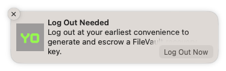

In a [previous post](../filevault-reissue), I recommended that MDM administrators switch from my previous FileVault reissue script to [Escrow Buddy](https://github.com/macadmins/escrow-buddy) for regeneration and escrow of missing FileVault recovery keys. I mentioned that if your organization already employs workflows that require occasional restarts or logouts — for example, enforcement of macOS updates/upgrades — then {}you probably don't need to augment Escrow Buddy with any additional user interaction or prompts{}. My own organization got close to 95% FileVault recovery key validity within a few months, with no user-facing prompts or reminders at all.

However, some organizations may want to pair some strategic user-facing notifications with Escrow Buddy to remind the user to log out so a new FileVault recovery key can be generated and escrowed.

Many possibilities exist for triggering these notifications with various MDMs and management tools. I'll share some examples in this post, categorized by user experience:

- **[Gentle notifications](#gentle-notifications)**
- **[Persistent reminders](#persistent-reminders)**
- **[Enforcement](#enforcement)**


In order to display notifications to end users on managed Macs without prompting for user approval first, you will likely need to deploy a MDM profile with the [Notifications payload](https://developer.apple.com/documentation/devicemanagement/notifications). For specific instructions, refer to the documentation of the notification tool you are using (for example, [this swiftDialog wiki page](https://github.com/bartreardon/swiftDialog/wiki/Notifications#approving-and-setting-notification-type-via-mdm)).


## Gentle notifications

If all you need is a subtle informational message that informs users that a log out is needed, a macOS notification banner may be your best choice. Many open-source tools can display a notification like this.

Click on the name of a tool below to see details.

<details><summary><h3>IBM Notifier</h3></summary><div>

Project URL: https://github.com/IBM/mac-ibm-notifications


```sh
#!/bin/bash
NOTIFIER="/Applications/IBM Notifier.app/Contents/MacOS/IBM Notifier"
"$NOTIFIER" -type banner \
    -title "Log Out Needed" \
    -subtitle "Log out at your earliest convenience to generate and escrow a FileVault recovery key." \
    -main_button_label "Log Out Now" \
    -secondary_button_label "Learn More" \
    -secondary_button_cta_type link \
    -secondary_button_cta_payload "https://www.betterbag.com/kb/123456"
if (( $? == 0 )); then
    osascript -e 'tell application "loginwindow" to «event aevtrlgo»'
fi
```

</div></details>
<details><summary><h3>SwiftDialog</h3></summary><div>

Project URL: https://github.com/bartreardon/swiftDialog


```sh
#!/bin/bash
/usr/local/bin/dialog --notification \
    --title "Log Out Needed" \
    --message "Log out at your earliest convenience to generate and escrow a FileVault recovery key."
```

</div></details>
<details><summary><h3>dataJAR Notifier</h3></summary><div>

Project URL: https://github.com/dataJAR/Notifier


```sh
#!/bin/bash
NOTIFIER="/Applications/Utilities/Notifier.app/Contents/MacOS/Notifier"
"$NOTIFIER" --type banner \
    --title "Log Out Needed" \
    --message "Log out at your earliest convenience to generate and escrow a FileVault recovery key." \
    --messageaction logout
```

</div></details>
<details><summary><h3>Terminal Notifier</h3></summary><div>

Project URL: https://github.com/julienXX/terminal-notifier


```sh
#!/bin/bash
NOTIFIER="/Applications/Utilities/terminal-notifier.app/Contents/MacOS/terminal-notifier"
"$NOTIFIER" -type banner \
    -title "Log Out Needed" \
    -message "Log out at your earliest convenience to generate and escrow a FileVault recovery key." \
    -sender com.apple.systempreferences
```

</div></details>
<details><summary><h3>Yo</h3></summary><div>

Project URL: https://github.com/sheagcraig/yo



```sh
#!/bin/bash
cat << EOF > /tmp/logout.sh
osascript -e 'tell application "loginwindow" to «event aevtrlgo»'
EOF
chmod +x /tmp/logout.sh
SCHEDULER="/usr/local/bin/yo_scheduler"
"$SCHEDULER" --title "Log Out Needed" \
    --subtitle "Log out at your earliest convenience to generate and escrow a FileVault recovery key." \
    --action-btn "Log Out Now" \
    --bash-action "/tmp/logout.sh"
```

</div></details>

&nbsp;

Many of the above apps offer administrators the ability to customize which icon is used in the notification. You may prefer to use a familiar company logo or one associated with the information security team or the IT Help Desk.

With the proper parameters, the notification could automatically log out when the action button is clicked, or could offer a "Learn More" option that links to an internal company knowledge base article about the FileVault escrow initiative. See the documentation for the notification tool you're using (linked above) for details on how to configure custom actions.

## Persistent reminders

A one-time notification that appears on screen for only a few seconds may not be enough for some organizations. In those situations, you may want to use the "alert" feature instead of the "banner" feature of the tools above, which ensures the notification will remain on screen unless/until the user dismisses it. (See more information on banners and alerts from Apple [here](https://support.apple.com/guide/mac-help/change-notifications-settings-mh40583/mac#:~:text=Application%20Notifications).)

Alternatively, if your company's MDM tool includes a user-facing app, you could leverage that to ensure users see the recommended action and context around it.

### Jamf: Self Service

For Jamf users, a policy in the Self Service app could inform users of affected Macs that they need to log out in order to escrow a FileVault key to Jamf.


The smart group criteria used to scope this Self Service policy would be the same as the criteria being used to set `GenerateNewKey` to `true` when deploying Escrow Buddy.

In order to facilitate the log out, the Self Service policy could execute a script or one-line process, or you could configure the policy with a Restart payload in place of logging out. Either will work.

### Munki: Managed Software Center

For Munki users, a [nopkg item](https://github.com/munki/munki/wiki/nopkgs) can appear in Managed Software Center and inform users of the need to log out. The item's pkginfo would contain an `installcheck_script` that reads the status of the `GenerateNewKey` preference, and a `RestartAction` that requires logout.

When a Mac matches the eligiblity criteria in the `installcheck_script`, the user would see the following in the **Updates** section of Managed Software Center:


An example pkginfo file that drives the above workflow is provided below.



## Enforcement

If your organization truly requires timely remediation of FileVault keys that aren't escrowed, it's possible to construct a more forceful workflow.


The workflows outlined in this section are more likely to leave a bad impression with your users, and may even cause data loss in apps that don't autosave. Proceed with caution.


### Munki: Managed Software Center (Enforced)

One option for this, if you use Munki for software distribution, would be to pair the Munki pkginfo in the section above with a `force_install_after_date` deadline like this:

```xml
<key>force_install_after_date</key>
<date>2023-09-20T15:00:00Z</date>
```

This produces the messaging shown below, and which will force a logout to occur after the specified time. Note that the time is local to the managed Mac's time zone, despite the `Z` suffix.


### swiftDialog deferrals

Another option for enforcement is to use a user deferral script like the example outlined [here](https://bigmacadmin.wordpress.com/2023/02/20/scripting-user-deferrals-with-swiftdialog/). You would need to customize the `check_the_things()` function to define the criteria that determine whether the Mac is eligible for escrow; use [the `installcheck_script` from the Munki pkginfo example above](https://gist.github.com/homebysix/41b099cf1f7ff49e0fb286a854b64551#file-filevault_escrow_helper-1-0-plist-L23) as inspiration. You would also need to customize the `do_the_things()` function to trigger a logout to occur.

However, both of these enforcement options should be considered a last resort, as they reintroduce many of the communication and context-setting requirements of the reissue script itself and could create a poor experience for your users.
