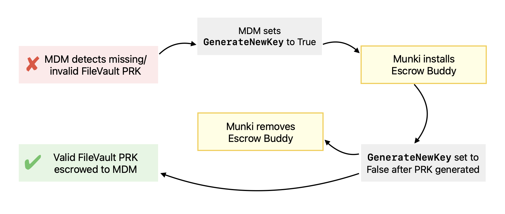

In this post I'll share a workflow that leverages Munki conditional items to install and remove [Escrow Buddy](https://github.com/macadmins/escrow-buddy/) dynamically. If your organization delivers Escrow Buddy via [Munki](https://www.munki.org/munki/), this workflow could serve as an automatic "on/off switch" that works in tandem with your MDM to ensure Escrow Buddy is installed only when needed.

The main benefit of this workflow is that it minimizes the number of Macs on which Escrow Buddy is installed unnecessarily, which could help streamline compatibility testing or simplify troubleshooting tasks relating to macOS login. Reducing the footprint of management tools is always a good idea whenever possible.

Once everything is set up and working, the workflow will look like this:



The Munki install and removal steps outlined in yellow are what we'll cover in this post.


Before we start, you'll need to have these two requirements set up:

- **Escrow Buddy must be imported into your Munki repository.**  
    [This AutoPkg recipe](https://github.com/autopkg/homebysix-recipes/blob/master/Escrow%20Buddy/Escrow%20Buddy.munki.recipe) is a good way to do that.
- **Your MDM must set `GenerateNewKey` to True on Macs that lack a valid FileVault PRK.**  
    See [this page](https://github.com/macadmins/escrow-buddy/wiki/Deployment) on the Escrow Buddy wiki for details.


## Munki conditional item

This automation relies on Munki's [Conditional Items](https://github.com/munki/munki/wiki/Conditional-Items) feature, which allows administrators to define specific conditions that must be met in order to trigger software installations or removals. I use the [Munki Facts](https://github.com/munki/munki-facts) framework to manage these conditions.

Within my Munki Facts packaging project payload, I install a file at _/usr/local/munki/conditions/facts/escrow_buddy_eligible.py_, containing the following script:

```py
#!/usr/local/munki/munki-python
"""Returns True if this Mac is configured for Escrow Buddy to generate a new
FileVault recovery key at next login, False otherwise. This allows Munki to
install Escrow Buddy only on Macs that have been identified by Jamf as needing
a new recovery key escrowed."""

import os
import plistlib


def fact():
    """Return our fact"""

    # Path to Escrow Buddy preference plist
    # NOTE: GenerateNewKey should never be set by an MDM profile
    EB_PLIST = "/Library/Preferences/com.netflix.Escrow-Buddy.plist"

    # Set eligible to False by default
    eligible = False
    if os.path.exists(EB_PLIST):
        try:
            with open(EB_PLIST, "rb") as infile:
                plist = plistlib.load(infile)
            if plist.get("GenerateNewKey") is True:
                eligible = True
        except plistlib.InvalidFileException:
            print(f"ERROR: Error reading plist file: {EB_PLIST}")

    return {"escrow_buddy_eligible": eligible}


if __name__ == "__main__":
    # Debug/testing output when run directly
    print(fact())
```

When Munki checks for new software, the Munki Facts framework executes this script and updates the _ConditionalItems.plist_ file with its result.

## Munki manifest

With the conditional item in place, we can now adjust our Munki manifests. Escrow Buddy should be nested within two mutually-exclusive conditions: one for **installation** on eligible Macs, and one for **removal** on non-eligible Macs.

```xml
<key>conditional_items</key>
<array>
    <dict>
        <key>condition</key>
        <string>escrow_buddy_eligible == TRUE</string>
        <key>managed_installs</key>
        <array>
            <string>EscrowBuddy</string>
        </array>
    </dict>
    <dict>
        <key>condition</key>
        <string>escrow_buddy_eligible != TRUE</string>
        <key>managed_uninstalls</key>
        <array>
            <string>EscrowBuddy</string>
        </array>
    </dict>
</array>
```

## Munki pkginfo

In order for the installation and removal to be complete and effective, verify your Escrow Buddy pkginfo file includes an [`installcheck_script` that checks the authorization database](https://github.com/autopkg/homebysix-recipes/blob/0d4511342cb14467525fce0542bbf8be364fd555/Escrow%20Buddy/Escrow%20Buddy.munki.recipe#L117) and an [`uninstall_script` that removes Escrow Buddy from the authorization database](https://github.com/autopkg/homebysix-recipes/blob/0d4511342cb14467525fce0542bbf8be364fd555/Escrow%20Buddy/Escrow%20Buddy.munki.recipe#L43). If you've created an override of the [Escrow Buddy.munki](https://github.com/autopkg/homebysix-recipes/blob/master/Escrow%20Buddy/Escrow%20Buddy.munki.recipe) recipe prior to 2024, your override may not have those items. You can use `autopkg make-override --force "Escrow Buddy.munki"` to create a new override.

## Expected outcome

After implementing this workflow, I would expect to see the number of Macs on which Escrow Buddy is installed to approximately match the number of Macs that have missing or invalid PRKs in MDM — ideally trending down to near zero.
