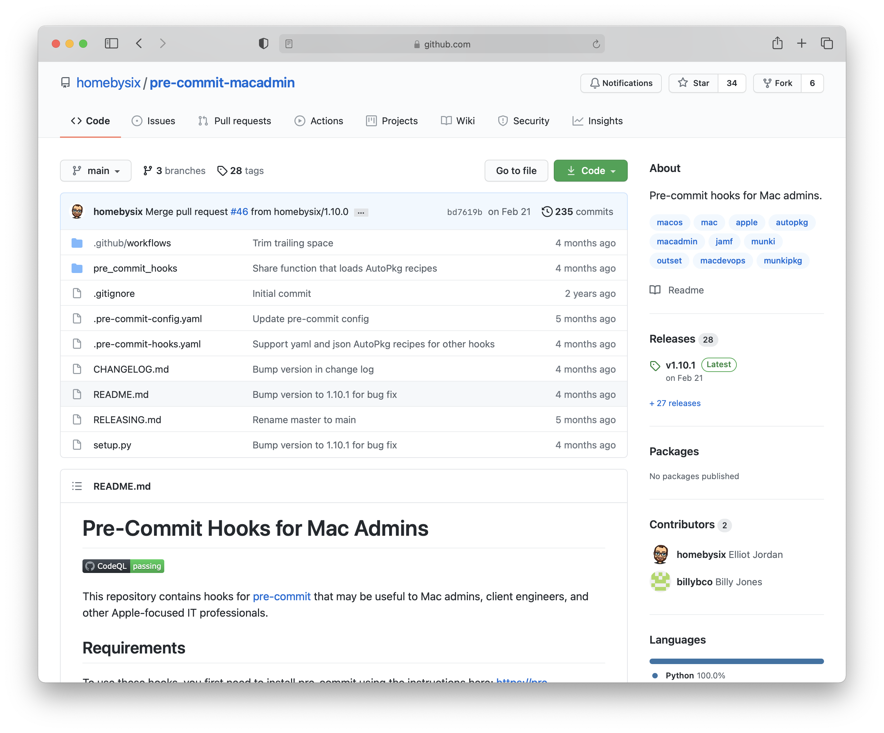

In a [previous post](../pre-commit-01-intro), I showed you how to set up [pre-commit](https://pre-commit.com) to perform some basic checks on your Git repo before each commit. In this one I'll provide some more specific recommendations for Mac admins who maintain a repository of [AutoPkg](https://github.com/autopkg/autopkg) recipes.

All you need is a Git repo that contains AutoPkg recipes. Recipe authors with repositories in the AutoPkg GitHub organization will find this especially useful (since their recipes are under a bit more scrutiny), but the same principles apply equally to private repositories or repositories hosted somewhere other than GitHub.

## Pre-Commit Hooks for Mac Admins

Although there are many [pre-commit hooks](https://pre-commit.com/hooks.html) available, I needed something that would understand and parse various file formats and conventions used by Mac admins. So I wrote my own repository of [Mac admin pre-commit hooks](https://github.com/homebysix/pre-commit-macadmin). I've started off with a few AutoPkg, Munki, Jamf, and packaging related hooks, and I'm sure I'll add more over time.

[](https://github.com/homebysix/pre-commit-macadmin)

## Setup

To [review](../pre-commit-01-intro#setup), here's how you'd start using pre-commit in a repository:

1. If you haven't already, [install pre-commit](https://pre-commit.com/#install). I choose to do this with Homebrew:

    ```sh
    brew install pre-commit
    ```

2. Create, commit, and push a _.pre-commit-config.yaml_ file at the root of your AutoPkg recipe repository. (I'll provide some examples below.)

3. Finally, activate the hooks in your Git repo:

    ```sh
    cd ~/Developer/your_git_repo
    pre-commit install
    ```

Let's talk about what AutoPkg hooks are available in this repository, what they do, and how you can customize them for your (or your organization's) needs.

## Check recipes

The `check-autopkg-recipes` hook includes numerous tests for AutoPkg recipes, many of which are proudly based on my own past mistakes. Here's a _.pre-commit-config.yaml_ file that includes this hook in its configuration:

```yaml {linenos=table}
repos:
  - repo: https://github.com/homebysix/pre-commit-macadmin
    rev: v1.18.0
    hooks:
      - id: check-autopkg-recipes
```

<!-- NOTE: Periodically verify and update this list of pre-commit checks. -->

As of this writing, the list of checks includes:

- **The recipe must be a valid plist or YAML file.** This hook will catch basic syntax or formatting errors in your recipes, which can be particularly undesirable in public repositories.

- **The recipe must contain a unique `Identifier` key at the top level.** AutoPkg uses this identifier to reference recipes and construct parent/child relationships between recipes. The hook ensures that the identifier is unique (within your repository) and that the identifier isn't the same as the `ParentRecipe` (which would cause a loop).

- **The recipe's `Identifier` must start with the specified prefix.** For most recipes in the public AutoPkg GitHub organization, the identifier starts with `com.github.` followed by the GitHub username of the author, followed by the recipe type and name of the software. For example: `com.github.homebysix.munki.coconutBattery`

    The default prefix is `com.github.`, but you can customize this hook by providing your own prefix in the hook arguments in your _.pre-commit-config.yaml_ file:

    ```yaml {linenos=table, hl_lines=[6]}
    repos:
      - repo: https://github.com/homebysix/pre-commit-macadmin
        rev: v1.18.0
        hooks:
          - id: check-autopkg-recipes
            args: ["--recipe-prefix=com.github.homebysix."]
    ```

- **Recipe processors must have a `Processor` key.** In the [Process array](https://github.com/autopkg/autopkg/wiki/Recipe-Format#process), `Arguments` are optional, but the `Processor` string is not.

- **Recipes that use a downloader processor must also have an `EndOfCheckPhase` processor.** [EndOfCheckPhase](https://github.com/autopkg/autopkg/wiki/Processor-EndOfCheckPhase) is conventionally used to signal where to stop when running AutoPkg in `--check` mode. Omitting this processor may cause your recipe to take more actions than AutoPkg users expect it to in that mode.

- **`%NAME%` should not be used in place of an app path in processor arguments.** AutoPkg users sometimes override the `NAME` input variable of a recipe to customize how the software will be referenced in a Munki repo or a Jamf policy. Using `%NAME%` instead of the actual app's name will needlessly break processes like CodeSignatureVerifier and Versioner if the `NAME` is customized.

- **Deprecated processors and superclass processors should not be used.** This applies to processors like [CURLDownloader](https://github.com/autopkg/autopkg/wiki/Processor-CURLDownloader) (which has been consolidated back into [URLDownloader](https://github.com/autopkg/autopkg/wiki/Processor-URLDownloader)) and [URLGetter](https://github.com/autopkg/autopkg/wiki/Downloading-from-the-Internet-in-Custom-Processors) (which should be used by other processors instead of being called directly).

- (Only if the pre-commit hook is running on a Mac with AutoPkg installed) **Processor arguments should be limited to the input variables defined in the processor code.** This broadly catches typos in processor arguments (for example, incorrectly using `requirements` for [CodeSignatureVerifier](https://github.com/autopkg/autopkg/wiki/Processor-CodeSignatureVerifier) instead of `requirement`).

- **A warning will occur if the AutoPkg `MinimumVersion` of the recipe is incompatible with any processor used in that recipe.** For example, the [DeprecationWarning](https://github.com/autopkg/autopkg/wiki/Processor-DeprecationWarning) processor was introduced in AutoPkg 1.1, so if a recipe uses DeprecationWarning and has a `MinimumVersion` lower than 1.1, the hook will display a warning.

    By default, these warnings will only occur for processors that require AutoPkg version 1.0 or higher. You can customize this threshold by defining the `--ignore-min-vers-before` argument. Setting a higher version here would silence warnings that don't really matter in the real world where most AutoPkg users have at least version 1.4.1 installed. Setting a lower version would gently encourage technical accuracy and ease troubleshooting for the few who are using a very old version of AutoPkg.

    ```yaml {linenos=table, hl_lines=[9]}
    repos:
      - repo: https://github.com/homebysix/pre-commit-macadmin
        rev: v1.18.0
        hooks:
          - id: check-autopkg-recipes
            args:
              [
                "--recipe-prefix=com.github.homebysix.",
                "--ignore-min-vers-before=1.4.1",
                "--",
              ]
    ```

    
    When using complex pre-commit hook arguments, I tend to include a double-dash (`--`) as the final argument. In [POSIX shell conventions](https://pubs.opengroup.org/onlinepubs/9699919799/basedefs/V1_chap12.html#tag_12_02), the double-dash is used to indicate the end of the option-arguments in a command. Pre-commit passes these arguments to the hook followed by the filenames of the files eligible for testing, so the double-dash offers some additional assurance that the filenames won't be parsed as options.
    

Munki recipes that contain `pkginfo` dictionaries within their `Input` section must also pass these tests:

- **All pkginfo keys must be set to the expected type.** This ensures that a key like `blocking_applications` is set to an array instead of a string, for example.
- **If a `RestartAction` key is specified, it must be one of the allowed values.** See the Munki [Supported Pkginfo Keys](https://github.com/munki/munki/wiki/Supported-Pkginfo-Keys) wiki page for a list of allowed values.
- **Common typos for the `minimum_os_version` and `maximum_os_version` key names are detected.** I've mistakenly used `min_os_version` or `minimum_os_vers` before, neither of which will have the desired effect.

## "Strict" mode

The `check-autopkg-recipes` hook also offers a "strict" mode that runs some additional checks. These checks are very opinionated and will certainly be too nitpicky for many, but I tend to use strict mode for my own recipes. If you're just starting out with a new repo, you might consider using strict mode from the beginning.

To enable strict mode, add `--strict` to the `check-autopkg-recipes` hook arguments, like so:

```yaml {linenos=table, hl_lines=[8]}
repos:
  - repo: https://github.com/homebysix/pre-commit-macadmin
    rev: v1.18.0
    hooks:
      - id: check-autopkg-recipes
        args: [
            "--recipe-prefix=com.github.homebysix.",
            "--strict",
            "--",
        ]
```

The additional checks run by strict mode include:

- **`MinimumVersion` incompatibility warnings become actual failures.** This applies to processors that require any previous version of AutoPkg all the way back to 0.1.0. The `--ignore-min-vers-before` argument is unnecessary when `--strict` is set.

- **Recipe type conventions are enforced.** For example, a "download" recipe should download software (and optionally verify its contents), a "munki" recipe should import software into your Munki repository, and a "pkg" recipe should create a package. In strict mode, failures will result if the processors used in the recipe don't align with the conventional use of the recipe's type.

- **Recipes should not have HTML-style comments.** Comments `<!-- like this -->` are allowable in XML plists, but are discarded when manipulating recipes using `plutil` or Python's `plistlib`. Therefore if a comment is important to retain, it should be converted to a plist string:

    ```xml
    <key>Comment</key>
    <string>This comment won't be removed by plutil and plistlib.</string>
    ```

    
    In the example above, `Comment` is used as the name of the key, but you could use any name as long as it doesn't duplicate other keys in the same dictionary. Keep in mind `plutil` and `plistlib` also *alphabetize* plist keys, so if you want your comment to display in a specific order relative to other keys you could name it accordingly. `_Comment` would keep it at the top of the dictionary. `SomeOtherKey-Comment` would keep it sorted next to the `SomeOtherKey` it comments on.
    

## Check (or forbid) recipe overrides

If your repository is public, you may want to limit its contents to AutoPkg _recipes_ and not _overrides_, since overrides typically contain custom values for different organizations and trust information specific to individual environments. You can do this by adding the `forbid-autopkg-overrides` and/or `forbid-autopkg-trust-info` hooks to your _.pre-commit-config.yaml_ file:

```yaml {linenos=table, hl_lines=["11-12"]}
repos:
  - repo: https://github.com/homebysix/pre-commit-macadmin
    rev: v1.18.0
    hooks:
      - id: check-autopkg-recipes
        args: [
            "--recipe-prefix=com.github.homebysix.",
            "--strict",
            "--",
        ]
      - id: forbid-autopkg-overrides
      - id: forbid-autopkg-trust-info
```

Often an organization's internal AutoPkg repository will contain both recipes and overrides, but will use separate folders to store each. You can keep the overrides in their proper place by adding an `exclude` option with a regular expression matching the overrides' folder:

```yaml {linenos=table, hl_lines=[12, 14]}
repos:
  - repo: https://github.com/homebysix/pre-commit-macadmin
    rev: v1.18.0
    hooks:
      - id: check-autopkg-recipes
        args: [
            "--recipe-prefix=com.github.homebysix.",
            "--strict",
            "--",
        ]
      - id: forbid-autopkg-overrides
        exclude: ^RecipeOverrides/
      - id: forbid-autopkg-trust-info
        exclude: ^RecipeOverrides/
```

To ensure your recipe overrides begin with your desired identifier prefix, you can use the `--override-prefix` argument:

```yaml {linenos=table, hl_lines=[8]}
repos:
  - repo: https://github.com/homebysix/pre-commit-macadmin
    rev: v1.18.0
    hooks:
      - id: check-autopkg-recipes
        args: [
            "--recipe-prefix=com.github.homebysix.",
            "--override-prefix=local.",
            "--strict",
            "--",
        ]
      - id: forbid-autopkg-overrides
        exclude: ^RecipeOverrides/
      - id: forbid-autopkg-trust-info
        exclude: ^RecipeOverrides/
```

The default override prefix is `local.`, which aligns with AutoPkg's default identifiers for newly-created overrides.

## Check recipe lists

Another common type of file found in organizations' internal AutoPkg repositories is a [recipe list](https://github.com/autopkg/autopkg/wiki/Running-Multiple-Recipes) — a text or plist file that contains a list of recipes that AutoPkg will run.

The `check-autopkg-recipe-list` hook performs two checks on these files:

- **Ensure that the file is a valid text, plist, YAML, or JSON file.** AutoPkg only supports text and plist recipe list formats, but there's nothing stopping AutoPkg users from writing their own runner script that leverages a recipe list in YAML or JSON format.

- **Ensure that `MakeCatalogs` is the last item in the list, if any Munki recipes are listed.** This guarantees that catalogs are rebuilt at the end of the recipe run, which [prevents duplicate imports](https://github.com/autopkg/autopkg/wiki/FAQ#every-time-i-run-a-munki-recipe-it-keeps-importing-the-item-into-my-repo-why) on the next run.

Here's a _.pre-commit-config.yaml_ file that includes the recipe list hook, in addition to the hooks covered above:

```yaml {linenos=table, hl_lines=[16]}
repos:
  - repo: https://github.com/homebysix/pre-commit-macadmin
    rev: v1.18.0
    hooks:
      - id: check-autopkg-recipes
        args: [
            "--recipe-prefix=com.github.homebysix.",
            "--override-prefix=local.",
            "--strict",
            "--",
        ]
      - id: forbid-autopkg-overrides
        exclude: ^RecipeOverrides/
      - id: forbid-autopkg-trust-info
        exclude: ^RecipeOverrides/
      - id: check-autopkg-recipe-list
```

## Other helpful hooks

Aside from my custom pre-commit hooks, I leverage some publicly available hooks for more basic checks. These are from the [pre-commit/pre-commit-hooks](https://github.com/pre-commit/pre-commit-hooks) GitHub repository unless otherwise specified.

I find these useful for almost any Git repo:

- `check-case-conflict`: Check for files that would conflict in case-insensitive file systems
- `check-executables-have-shebangs`: Ensure that (non-binary) executables have a shebang
- `check-merge-conflict`: Check for files that contain merge conflict strings
- `detect-private-key`: Detect the presence of private keys
- `end-of-file-fixer`: Ensure that a file is either empty, or ends with one newline
- `fix-byte-order-marker`: Remove UTF-8 byte order marker
- `mixed-line-ending`: Replace or check mixed line endings
- `no-commit-to-branch`: Prevent committing to default branch
- `trailing-whitespace`: Trim trailing whitespace (I usually add the `"--markdown-linebreak-ext=md"` argument to allow [double-space line breaks](https://daringfireball.net/projects/markdown/syntax#p))

For AutoPkg recipe repositories that also contain Python processors, you might consider including some of these:

- `black` (from [psf/black](https://github.com/psf/black)): Apply [Python Black](https://black.readthedocs.io/en/stable/) autoformatting
- `check-ast`: Check whether .py files parse as valid Python
- `check-docstring-first`: Ensure Python docstrings are in the right place
- `fix-encoding-pragma`: Add `# -*- coding: utf-8 -*-` to the top of Python files
- `flake8` (from [pycqa/flake8](https://github.com/pycqa/flake8)): Lint Python files with [flake8](https://flake8.pycqa.org/en/latest/)
- `pylint` (from [pycqa/pylint](https://github.com/pycqa/pylint)): Lint Python files with [pylint](https://pylint.pycqa.org/en/latest/)

And if you have YAML recipes in your repo, you can add this hook to check those:

- `check-yaml`: Check yaml files for syntax errors

There are hundreds more hooks to choose from, but do keep in mind that each hook will add slightly to the execution time that occurs for every commit, as well as add some minor operational burden for you and your contributors. Focus on the ones that will provide the most tangible benefit.

As you discover and add new hooks, you may want to use `pre-commit run --all-files` to test whether they surface any failures. (See the "[Testing All Files](../pre-commit-01-intro#testing-all-files)" section of my introductory post for details and sample output.)

## Examples

I've compiled some example _.pre-commit-config.yaml_ files using various combinations of the hooks mentioned above for different AutoPkg repo situations. Substitute your desired recipe prefix and drop one of these into your AutoPkg repo to get started with minimum fuss.

- [Example 1: Public AutoPkg recipe repository (basic)](https://gist.github.com/homebysix/f7872534bc081b691757bea64a28aa8c)
- [Example 2: Public AutoPkg recipe repository (extended)](https://gist.github.com/homebysix/9e8ddaf424bd46af71ee973033b4ecfd)
- [Example 3: Public AutoPkg recipe repository with processors](https://gist.github.com/homebysix/ddb4efea90a86189cab6ac65204998ea)
- [Example 4: Private AutoPkg recipe repository with YAML recipes and overrides](https://gist.github.com/homebysix/833cf22ae8f52b659545027e30ae1ba3)
- [Example 5: Private AutoPkg recipe repository with processors](https://gist.github.com/homebysix/b29c7414b3e33e1c9d718e147af2b82d)

---

I hope my pre-commit hooks help encourage peace of mind when committing to your AutoPkg recipe repos. They have certainly helped me.

If you have suggestions or questions about my hooks (or if you'd like to contribute code) please consider submitting an issue or pull request on my [pre-commit-macadmin](https://github.com/homebysix/pre-commit-macadmin) GitHub repository.
